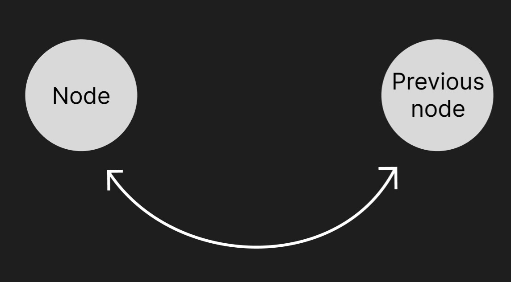

# Distributed Database

## Get started

### Installation

To generate database node you need to run this command:

``` bash
javac ./DatabaseNode/src/DatabaseNode/Main/DatabaseNode.java
java ./DatabaseNode/src/DatabaseNode/Main/DatabaseNode.java --tcpport [port]
```

The `-connect [address]:[port]` and `-record [key]:[value]` operations are additional commands.  
`-connect [address]:[port]` - this command connects server to the node on ip **address** and **port**.  
`-record [key]:[value]` - this command stores **value** under **key** on this server.

### Usage

This project is a distributed database, which is a database not on one device but on a few devices. 
Every device is a database node. If you want to be part of a database then you need to connect your node to another node using `-connect [address]:[port]` command while starting a program.
This distributed database has **ring topology**, which means, no mater how you connect the nodes, they will always
create a ring of connections.

When database is created (has more than one node), you can control it by TCP clients. Exemplary client is in `DatabaseNode/src/DatabaseClient.java` file.
Client has few operation which will be operated by node, nodes or whole database. More about clients you can find in `client` part of documentation.

If you want to try it out, you can run exemplary scripts. You can find them in `DatabaseNode/Scripts`.

## Description:

---
This project is a distributed database. To create a database you need to connect few DatabaseNodes using "-connect
address:port" operation.

To generate database node you need to run "src/DatabaseNode/Main/DatabaseNode.java" with "-tcpport port" arguments.  
The "-connect address:port" and "-record key:value" operations are additional commands.  
"-connect address:port" - this command connects server to the node on **address** and **port**.  
"-record key:value" - this command stores **value** under **key** on this server.

This distributed database has **ring topology**, which means, no mater how you connect the nodes, they will always
create a ring.  


#### Database with first node:

  
Node points to next node and previous node. At first, next node and previous node are the same node (node points at
itself).

#### Better look to what are next node and previous node:

 

#### Adding second node:

  
Now node's next node is **new node** and node's previous node is also **new node**.  
New node's next node is **node** and new node's previous node is also **node**.

#### Adding third node to first node:


#### Adding third node to second node:


### Client

When you have created a distributed database by connection few nodes, then you want to actually use it somehow.
The TCP client is responsible for this. If you want, you can connect your own TCP client, there is only one rule, first communique need to be "Client" message.   
Client has few available requests:

- `set-value** [key]:[value]` - set value on **key** to **value**. Returns communicate "OK" if **key** was found and **value** is set or "ERROR" if **key** was not found and **value** is not set.
- `get-value [key]` - returns communique "key:value" if **key** was found or "ERROR" if **key** was not found.
- `find-key [key]` - returns "address:value" if **key** was found or "ERROR" if **key** was not found.
- `get-max` - returns communique "key:value" of the biggest value in database.
- `get-min` - returns communique "key:value" of the smallest value in database.
- `new-record` key:value - sets new **key** and new **value** on node to which the request was sent.
- `terminate` - shutdown the node to which the request was sent.

Client can use one operation at the time.  
To the database can connect few clients at the same time. Database node is multithreaded server, so operations should not collide with each other.

#### Trip of the request:

         
Client connects to node. If this node have information, then it returns result of an operation. If this node does not
have information, then request is forwarded to its next node.  
It goes till information is found or node's next node it the starting one.

If first node forwards request then a **prefix**, which is **port** of this node, is added to the request. This **
prefix** informs other nodes that this request comes from a node which port is this **prefix**. This **prefix** also is
used by checking if request can be forwarded. If current node's next node port is the same as the **prefix**, then
request can not be forwarded.  
If current node does have required information, then result of an operation starts its way back. It finally goes to the
corresponding client.  
If current node does not have required information and request can not be forwarded, then "ERROR" message is returned
and this communique starts its way back to the first node and finally to corresponding client.  
Operations like "get-max" or "get-min" every time go to every node of the web.  
Operation "terminate" goes only to one node of the web, but this node sends notifications to his **next node** and **
previous node** to inform them about shutdown. It uses "newPrevious address:port" and "newNext address:port" operations
for that.

---

## Description of the individual elements of the DistributedDatabase:

### DatabaseNode

DatabaseNode class is the Main class. It recognizes information given in arguments of project to start the server. It
uses **recognizeCommand()** method to assign the fields.
After recognizing and assigning the fields, **main()** method can set up the server.

DatabaseNode can be created with or without stored value.  
If server need to be hooked to the web, then **connect()** method need to be called with **destination address** and **
destination port** values.  
Connecting server to the node replaces node's next node with server, and node's next node's previous node is set to this
server. So this server is added between node and node's next
node.  

Now server is set up.

#### Methods:

- `main(String[] args)`

    This is **main** method. It sets up whole server.  
    Server can be set up with or without record, with or without connection, but it needs to have port number.  
    Main checks if args are fine and starts creates DatabaseNodeCenter, which is the brain of the server.

- `recognizeCommand(String[] commands)`

    This method recognizes and divides commands from **commands** array.  
    At first, fields are set to error values like "" or -1.  
    Then three patterns are created:
   - **portPattern** for recognizing the area with port.
   - **connectionPattern** for recognizing the area with connection data.
   - **recordPattern** for recognizing the area with value.

    Then, in for loop every pattern gets recognized and the fields are assigned with correct values.

---

### DatabaseNodeCenter:

DatabaseNodeCenter class is the heart of the server.  
It has thirteen fields:

- **PORT** - public field with local port number.
- **ADDRESS** - public field with local ip address text.
- **nextNodePort** - private field with port number of next connected node.
- **nextNodeAddress** - private field with InetAddress of next connected node.
- **previousNodePort** - private field with port number of previous connected node.
- **previousNodeAddress** - private field with InetAddress of previous connected node.
- **socketListener** - private field which is a reference to SocketListener class which is used to listen for new nodes
  or new clients.
- **key** - private field with key number of stored value.
- **value** - private field with stored value number.
- **running** - public filed which tells if server is running.
- **sendNext** - private field which tells if request can be sent to next node.

There are two constructors whose only deference is that one accepts key and value to be stored and second does not.
Their task is to assign fields.  
There are getters and setters for **nextNodePort** and **nextNodeAddress**.  
There is also **addOperateThread(String requestMessage, PrintWriter writer)** method, which creates and starts new **
OperateThread** with PrintWriter parameter.


#### Methods:

- `connect(String destinationAddress, int destinationPort)`

    This method is used to connect to the web. Its parameters are String **destinationAddress** and int **
     destinationPort**, whose are ip **address** and **port** of the node that it tries to connect.
    
    It creates **TCP** connection with node that it tries to connect (That node will be called "**previous node**").
    Then it sends "Node" message to let previous node know that it is a correct node, neither client nor inappropriate
    server.
    Next it sends its PORT and reads line of text (**response**).
    It checks if previous node allows to continue connection or if connection is already broke.  
    If **response** is "ERROR", then it means that connection can not be executed. The previous node responses are printed
    and "connect" method ends. Printed information should look like this:
    "ERROR"  
    "PORT ALREADY CONNECTED"
    
    If **response** is not "ERROR", then connection can be executed and **nextNodePort** field is declared.
    Next, by reading next line **nextNodeAddress** field is declared.  
    Next it assigns **previous node** port and address to **previousNodeAddress** and **previousNodePort** fields.  
    At the end, TCP connection can be closed by calling **Socket.close()** method and information "Connected to the node"
    is printed.

---

### OperateThread:

OperateThread class is inner class of DatabaseNodeCenter. It is a brain of the server. It recognizes given commands,
operates them properly and creates **UDP client** which will be connected to the next node.
Every request that comes to the server starts new OperateThread. Because of that, requests moving in the web do not
collide with each other.  
It has eight fields:

- **operation** - private final String with given operation command.
- **values** - private final String with given values. It could be "value_1:value_2" or "value".
- **prefix** - private final String with prefix of the request. If request comes from the client, then there is no
  prefix, so new prefix need to be added. It will be **PORT** of current server.
- **socket** - private DatagramSocket which is a UDP client.
- **sourceAddress** - private InetAddress which is address of UDP client that forwarded its request.
- **sourcePort** - private int which is port of UDP client that forwarded its request.
- **isFirst** - private final boolean which tells if this is a first node of current request.
- **writer** - private PrintWriter which is reference to PrintWriter which was used to communicate with TCP client.

There are three constructors. Every one of them is for different purpose.

- **OperateThread(String requestMessage, InetAddress sourceAddress, int sourcePort)** - request given from UDP client
  form previous node.
- **OperateThread(String requestMessage, PrintWriter writer)** - request given from TCP client.
- **OperateThread(String requestMessage, boolean isFirst)** - request that need to be sent to next or previous node. It
  is used only during **connect()** method.

#### Methods:

- `createSocket(int localPort)`

This method tries to create UDP server on given **localPort** with timeout of 500 milliseconds.

- `run()`

    This method is run method from Runnable interface.
    Firstly, it recognizes **operation** and call corresponding methods. The result of these methods is stored in **
    String[] result** variable.  
    Then First element of **result** is checked.  
    If this is "OK", then second element is sent to TCP client if this is first node of the request, or to source UDP
    client.
  - If this is "ERROR", then request is sent to next node or "ERROR" message goes back to source UDP client. If
      forwarding was possible then it waits for response which is stored in **String response** variable.
  - If **response** equals "NULL", then it means there was no received message and "ERROR" message is sent back to TCP
      client or source UDP client. If not, then it is sends **response** to TCP client or source UDP client.
  - If this is "ROUND", then it means this is "get-max" or "get-min" operation, and it was to go threw all nodes in
      database.

    At the end, if **writer** is not null then it is closed.

- `receiveMsg()`

    This method received message from other UDP clients.
    It also prints "Message received from [**sourcePort**]: [**message**]".  
    It returns the **message** in String format.  
    If there was no message received, then returns "NULL".

- `sendMsg(String msg, InetAddress destinationAddress, int destinationPort)`

    This method sends given **msg** to UDP server on given **destinationAddress** and **destinationPort**.
    It also prints "Message send from [this server PORT] to [**destinationPort**]: [**msg**]".  
    If there is a problem with sending the message, then it prints "Message send ERROR".

- `setValue(String[] values)`
    
    *Source code:*
``` java
private String[] setValue(String[] values) {
    if (key == Integer.parseInt(values[0])) {
        value = Integer.parseInt(values[1]);
        return new String[]
            {
                    "OK", 
                    "OK"
            };
    } else {
        return new String[]
            {
                "ERROR",
                prefix + " set-value " + values[0] + ":" + values[1]
            };
    }
}
```

- `getValue(int givenKey)`

  *Source code:*
``` java
 private String[] getValue(int givenKey) {
    if (key == givenKey) {
        return new String[]
            {
                    "OK",
                    key + ":" + value
            };
    } else {
        return new String[]
            {
                    "ERROR",
                    prefix + " get-value " + givenKey
            };
    }
}
```

- `findKey(int givenKey)`

  *Source code:*
``` java
private String[] findKey(int givenKey) {
    if (key == givenKey) {
        return new String[]
            {
                    "OK",
                    ADDRESS + ":" + PORT
            };
    } else {
        return new String[]
            {
                    "ERROR",
                    prefix + " find-key " + givenKey
            };
    }
}
```

- `getMax(int max)`

  *Source code:*
``` java 
private String[] getMax(int max) {
    int newMax = Math.max(value, max);

    return new String[]
        {
                "ROUND",
                prefix + " get-max " + newMax
        };
}
```

- `getMin(int min)`

  *Source code:*
``` java
private String[] getMin(int min) {
    int newMin = Math.min(value, min);

    return new String[]
        {
                "ROUND",
                prefix + " get-min " + newMin
        };
}
```

- `newRecord(String[] values)`

  *Source code:*
``` java 
private String[] newRecord(String[] values) {
    key = Integer.parseInt(values[0]);
    value = Integer.parseInt(values[1]);

    return new String[]
        {
                "OK",
                "OK"
        };
}
```

- `String[] terminate()`

  *Source code:*
``` java 
private String[] terminate() {
    sendMsg(PORT + " newPrevious " + previousNodeAddress.getHostAddress() + ":" + previousNodePort, nextNodeAddress, nextNodePort);
    sendMsg(PORT + " newNext " + nextNodeAddress.getHostAddress() + ":" + nextNodePort, previousNodeAddress, previousNodePort);

    new Thread(() -{
        try {
            Thread.sleep(500);
            writer.close();
            socket.close();
            System.exit(0);
        } catch (InterruptedException e) {
            throw new RuntimeException(e);
        }
    }).start();

    return new String[]
        {
                "OK",
                "OK"
        };
}
```

---

### RequestListener

This is inner class in **NodeCommunication** class. 
Its job is to receive messages and creates new OperateThread thread with this message as argument.  
it has three fields:
- **socket** - private DatagramSocket which is a UDP client.
- **sourcePort** - private int which is port of the sender.
- **sourceAddress** - private InetAddress which is address of the sender. 

There is a constructor which creates **socket** on this node's **PORT**.

#### Methods:

- `run()`

    This method is run method from Runnable interface.  
    This method receives message over and over again.
    Then it creates OperateThread with these received message.

- `receiveMsg()`

    This method receives messages from UDP clients.
    If message is received then "Message received from  [sourcePort]: [message]".

---

### SocketListener:

This class is a TCP server thread, which task is to handle TCP connections.  
It has one field:

- **node** - private final field with reference to DatagramNode which "this" node.

There is a constructor which job is to assign **node** field.

#### Methods:

- `run()`

    This method is run method from Runnable interface. Its listens for incoming TCP connections.
    In constant while loop **socket** variable is assigned by calling **accept()** method on **server** variable, which is
    ServerSocket.
    Then this assigned **socket** variable is sent to **recognizeSocket()** method.

- `recognizeSocket(Socket socket)`

    This method communicate with given **socket** and handle it properly.
    It communicates by BufferedReader **read** variable and PrintWriter **write** variable.
    
    Firstly, it reads first message. There are three possible options:
    If it is "Node", then it means a node is tying to connect to this node.
    Then next message is read. This message is this new node's port.
    Then **nextNodePort** and **nextNodeAddress** are sent using **println()** method on **write** variable.
    Then **nextNodePort** and **nextNodeAddress** are set to socket's **address** and given **socket's** **port**.
    Next "Node connected" message is printed.
    
    If it is "Client", then it means a client is trying to communicate with this node.
    new OperateThread is created with message from this client and **write** variable. It
    handles this client and "Client connected" is printed.
    
    If it is any other option, then is means the node can not recognize it and sends "Not recognized" message using **
    println()** method on **write** variable.
    Then "Not recognized socket :: ip = " with address of given **socket** is printed and given **socket** is closed. 

# Jakub Szarpak