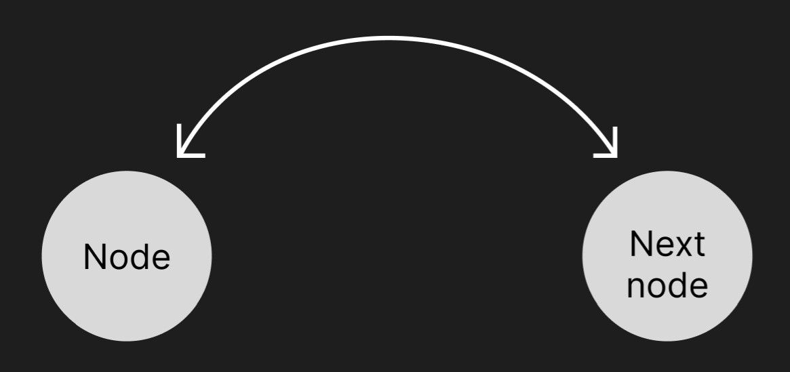

# Distributed Database
# Jakub Szarpak

---
## How to run this program:

---
To generate database node you need to run "src/DatabaseNode/Main/DatabaseNode.java" with "-tcpport port" arguments.  
The "-connect address:port" and "-record key:value" operations are additional commands.  
"-connect address:port" - this command connects server to the node on **address** and **port**.  
"-record key:value" - this command stores **value** under **key** on this server.

You can also use this script: "".

---
## Description:

---
This project is a distributed database. To create a database you need to connect few DatabaseNode using "-connect address:port" operation.

To generate database node you need to run "src/DatabaseNode/Main/DatabaseNode.java" with "-tcpport port" arguments.  
The "-connect address:port" and "-record key:value" operations are additional commands.  
"-connect address:port" - this command connects server to the node on **address** and **port**.  
"-record key:value" - this command stores **value** under **key** on this server.  

This distributed database has **ring topology**, which means, no mater how you connect the nodes, they will always create a ring.  

#### Database with first node:  
  
Node points to next node and previous node. At first, next node and previous node are the same node (node points at itself).  
#### Better look to what are next node and previous node:  
   
#### Adding second node:  
  
Now node's next node is **new node** and node's previous node is also **new node**.  
New node's next node is **node** and new node's previous node is also **node**.

#### Adding third node to first node:  

#### Adding third node to second node:  

**Client** can affect the database. [Exemplary database client]("./DatabaseNode/DatabaseClient/DatabaseClient.java").  
Client should run with arguments "**-gateway** address:port **-operation** operation with parameters".
Client have few allowed operations:
- **set-value** key:value - set value on **key** to **value**. Returns communicate "OK" if **key** was found and **value** is set or "ERROR" if **key** was not found and **value** is not set.
- **get-value** key - returns communique "key:value" if **key** was found or "ERROR" if **key** was not found.
- **find-key** key - returns "address:value" if **key** was found or "ERROR" if **key** was not found.
- **get-max** - returns communique "key:value" of the biggest value in database.
- **get-min** - returns communique "key:value" of the smallest value in database.
- **new-record** key:value - sets new **key** and new **value** on node to which the request was sent.
- **terminate** - shutdown the node to which the request was sent.

Client can use one operation at the time.  
To the database can connect few clients at the same time. (I run test with 50 clients connected at the same time with the same node)

#### Trip of the request:  
         
Client connects to node. If this node have information, then it returns result of an operation. If this node does not have information, then request is forwarded to its next node.  
It goes till information is found or node's next node it the starting one.

If first node forwards request then a **prefix**, which is **port** of this node, is added to the request. This **prefix** informs other nodes that this request comes from a node which port is this **prefix**. This **prefix** also is used by checking if request can be forwarded. If current node's next node port is the same as the **prefix**, then request can not be forwarded.  
If current node does have required information, then result of an operation start its way back. It finally goes to the corresponding client.  
If current node does not have required information and request can not be forwarded, then "ERROR" message is returned and this communique start its way back to the first node and finally to corresponding client.  
Operations like "get-max" or "get-min" every time go to every node of the web.  
Operation "terminate" goes only to one node of the web, but this node sends notifications to his **next node** and **previous node** to inform them about shutdown. It uses "newPrevious address:port" and "newNext address:port" operations for that.

---
## Description of the individual elements of the DistributedDatabase:

---
### DatabaseNode
  DatabaseNode class is the Main class. It recognizes information given in arguments of project to start the server. It uses "recognizeCommand()" method to assign the fields.
  After recognizing and assigning the fields, "main()" method can set up the server.

  DatabaseNode can be created with or without stored value.  
  If server need to be hooked to the web, then "connect()" method need to be called with destination address and destination port values.  
  Connecting server to the node replaces node's next node with server, and node's next node's previous node is set to this server. So this server is added between node and node's next node "Image_5.jpg", "Image_6.jpg".

  Now server is set up.

---
#### Methods:

- #### main(String[] args):  
> This is **main** method. It sets up whole server.  
> Server can be set up with or without record, with or without connection, but it needs to have port number.  
> Main checks if args are fine and starts creates DatabaseNodeCenter, which is the brain of the server.

- #### recognizeCommand(String[] commands):
> This method recognizes and divides commands from **commands** array.  
> At first, fields are set to error values like "" or -1.  
> Then three patterns are created:  
> - **portPattern** for recognizing the area with port.  
> - **connectionPattern** for recognizing the area with connection data.  
> - **recordPattern** for recognizing the area with value.  
> 
> Then, in for loop every pattern gets recognized and the fields are assigned with correct values.

---
### DatabaseNodeCenter:
  DatabaseNodeCenter class is the heart of the server.  
  It has thirteen fields:  
  - **PORT** - public field with local port number.
  - **ADDRESS** - public field with local ip address text.
  - **nextNodePort** - private field with port number of next connected node.
  - **nextNodeAddress** - private field with InetAddress of next connected node.
  - **previousNodePort** - private field with port number of previous connected node.
  - **previousNodeAddress** - private field with InetAddress of previous connected node.
  - **nodeCommunication** - private field which is a reference to NodeCommunication class which is used to communicate between nodes.
  - **socketListener** - private field which is a reference to SocketListener class which is used to listen for new nodes or new clients.
  - **key** - private field with key number of stored value.
  - **value** - private field with stored value number.
  - **wait** - public filed which tells if node communication should wait.
  - **running** - public filed which tells if server is running.
  - **sendNext** - private field which tells if request can be sent to next node.

  There are two constructors whose only deference is that one accepts key and value to be stored and second does not. Their task is to assign fields.
  There are getters and setters for **nextNodePort** and **nextNodeAddress**.

---
#### Methods:

- #### connect(String destinationAddress, int destinationPort):
> This method is used to connect to the web. Its parameters are String **destinationAddress** and int **destinationPort**, whose are ip **address** and **port** of the node that it tries to connect.
> 
> It creates **TCP** connection with node that it tries to connect (That node will be called "**previous node**"). 
> Then it sends "Node" message to let previous node know that it is a correct node, neither client nor inappropriate server. 
> Next it sends its PORT and reads line of text (**response**).
> It checks if previous node allows to continue connection or if connection is already broke.  
> If **response** is "ERROR", then it means that connection can not be executed. The previous node responses are printed and "connect" method ends. Printed information should look like this:  
> > "ERROR"  
> "PORT ALREADY CONNECTED"
>
> If **response** is not "ERROR", then connection can be executed and **nextNodePort** field is declared.
> Next, by reading next line **nextNodeAddress** field is declared.  
> Next it assigns **previous node** port and address to **previousNodeAddress** and **previousNodePort** fields.  
> At the end, TCP connection can be closed by calling **Socket.close()** method and information "Connected to the node" is printed.

- #### operate(String task):
> This method coordinates every request.
> If either node or client sends any request, then this method is called to divide tasks.
> Its parameter is String **task**, which is a line of request that was given to this server.  
> Thanks to project structure this is one of two **synchronized** parts of whole project.
>
> At first, it prepares by creating variables:
> - String **answer** and makes it an empty text
> - boolean **addYourPort** which tells if node should add its port to the request that is forwarded.
> 
> Then sets **wait** field to true.Then tries to sleep current thread for **nodeCommunication's** timeout and sets **nodeCommunication's** timeout to 0, which means there will be no timeout.  
> Then it creates ten patterns. Any but the first and last two are for every possible client operation. Last two are only for nodes.
> First one for checking if first four characters of request are a digits.
> If yes, then it means this is a request from node which port is that for digits.
> If no, then it means it is a request from a client.  
> Rest of the patterns are:
> - "setValuePattern" - for recognizing "set-value" operation.
> - "getValuePattern" - for recognizing "get-value" operation.
> - "findKeyPattern" - for recognizing "find-key" operation.
> - "getMaxPattern" - for recognizing "get-max" operation.
> - "getMinPattern" - for recognizing "get-min" operation.
> - "newRecordPattern" - for recognizing "new-record" operation.
> - "terminatePattern" - for recognizing "terminate" operation.
> - "newNextPattern" - for recognizing "newNext" operation which is used to sets "nextNodePort" and "nextNodeAddress" to new one.
> - "newPreviousPattern"- for recognizing "newPrevious" operation which is used to sets "previousNodePort" and "previousNodeAddress" to new one.
> - "find-port" - for recognizing "find-port" operation which is used to search if some node in the web already has that given port. This operation is used only in SocketListener if some node wants to connect to the web.
>
> Then it checks if forwarding the request is possible, by matching first pattern.
> If pattern is found, then it checks if **nextNodePort** not equals founded port. Result is assigned to **sendNext** field.
> If pattern is not found, then it checks if **nextNodePort** not equals current node's port. Result is assigned to **sendNext** field.
>
> It checks every next pattern till some is matched, because it allows only one operation at the time to be done.
> If some pattern is found, then it means that this is the operation that needs to be done.
> Proper method is called with proper parameters. That method result is the answer to the request.
> Operation **terminate** is different. It calls **terminate()** method, makes **answer** variable to be "OK" and starts new thread which changes **running** variable to false and after 5000 milliseconds shuts down whole server. Finally, it returns response from **endOperate()** method the same way as previously.
>
> At the end, **endOperate()** method is called to handle everything that needs to be done before the end of **operate()** method. 
> The replay of **endOperate()** method is returned by **operate()**.

- #### endOperate(String task, String answer):
> This method does everything that need to be done before **operate()** method could end.
> It sets **nodeConnection** timeout to 1 and sets **wait** field to false.  
> Its parameters are String **task** and String **answer**, whose are task and answer from operate.
>
> Firstly, it sets **nodeCommunication's** timeout to 1.
> Next **wait** field is changed to false.
> Finally, if returns given **answer** or if **answer** is empty, then it returns given **task**.

- #### forwardRequest(String msg, String failure):
> This method checks if request can be forwarded by checking **sendNext** field.
> If yes, then it forwards given **msg**, by calling **sendMsg()** method on **nodeCommunication**, to next node.
> It returns result of **receiveMsg()** method on nodeCommunication.
> If no, then it returns given **failure**, which is a text message of failing the task.

In the next part, parameters of methods will be similar to each other.  
The similarities are:  
1. String **prefix** - this is a port number in text format.
If request comes from client, then prefix would be empty. It tells the node, that it comes from a client, and this node will be called "first node".
If request comes from another node, then it has a prefix. This prefix is port number of **first node** (Node that client was connected). 
That means, the request can be forwarded till current node's **nextNodePort** equals this prefix.

2. boolean **addYourPort** - this is a bool parameter which tells if this node is "first node" of this request.
If yes, then if request needs to be forwarded, current node **port** will be added as a **prefix** to this request.
If no, then it if request needs to be forwarded, request will have the same **prefix**.

- #### setValue(int key, int value, String prefix, boolean addYourPort):
> This method sets new, given **value** for given **key**.
> If current node's **key** equals given **key**, then "Ok" is returned.
> Else this method returns result of calling **forwardRequest()** method with forwarded request and "ERROR" as failure message.
>
> If **addYourPort** is true, then forwarded request looks like "[port]set-value key:value".  
> if **addYourPort** is false, then forwarded request looks like "[prefix]set-values key:value".

- #### getValue(int key, String prefix, boolean addYourPort):
> This method returns "key:value" answer if current node's **key** field equals given **key**.
> If they are not equal, then method returns result of calling **forwardRequest()** method with forwarded request and "ERROR" as failure message.
>
> If **addYourPort** is true, then forwarded request looks like "[port]get-value key".  
> if **addYourPort** is false, then forwarded request looks like "[prefix]get-values key".

- #### findKey(int key, String prefix, boolean addYourPort):
> this method returns "address:port" answer if current node's **key** field equals given **key**.
> If they are not equal, then method returns result of calling **forwardRequest()** method with forwarded request and "ERROR" as failure message.
>
> If **addYourPort** is true, then forwarded request looks like "[port]find-key key".
>if **addYourPort** is false, then forwarded request looks like "[prefix]find-key key".

- #### getMax(int max, String prefix, boolean addYourPort):
> This method checks if current node's **value** field is bigger than given **max** number. Bigger one is assigned to **newMax** variable.
> It returns result of calling **forwardRequest()** method with forwarded request and **newMax** variable as failure message.
>
> If **addYourPort** is true, then forwarded request looks like "[port]get-max newMax".
> if **addYourPort** is false, then forwarded request looks like "[prefix]get-max newMax".

- #### getMin(int min, String prefix, boolean addYourPort):
> This method checks if current node's **value** field is smaller than given **min** number. Smaller one is assigned to **newMin** variable.
> It returns result of calling **forwardRequest()** method with forwarded request and **newMin** variable as failure message.
>
> If "addYourPort" is true, then forwarded request looks like "[port]get-min newMin".
> if "addYourPort" is false, then forwarded request looks like "[prefix]get-min newMin".

- #### newRecord(int key, int value):
> This method assigns **key** and **value** fields with new, given numbers.

- #### terminate():
> This method sends to **next node** "newPrevious" operation message with **previousNodeAddress** and **previousNodePort**
> and sends to **previous node** "newNext" operation message with **nextNodeAddress** and **nextNodePort**.
>
> Sent messages should look like:  
> "newPrevious previousNodeAddress:previousNodePort"  
> "newNext nextNodeAddress:nextNodePort"

- #### findPort(int port, String prefix, boolean addYourPort):
> This checks if given **port** is already connected to the web.
> It returns "ERROR" if **PORT** field equals given **port**.
> Else it returns result of calling **forwardRequest()** method with forwarded request and "OK" as failure message.
>
> If **addYourPort** is true, then forwarded request looks like "[port]find-port port".
> if **addYourPort** is false, then forwarded request looks like "[prefix]find-port port".

---
### NodeCommunication:
  NodeCommunication class is a UDP server, which task is to communicate with other node's UDP servers.
  It has four fields:
  - **nodeSocket** - private field with reference to DatagramSocket.
  - **node** - private final field with reference to DatagramNode which "this" node.
  - **timeout** - privet field which is a UDP server receiving soTimeout.
  - **sourcePort** - private field with port of the UDP server from whom a message was received.
  - **sourceAddress** - private field with address of the UDP server from whom a message was received.

  There is a constructor which job is to assign **node** field and start **RequestListener** thread.
  There is a getter for **timeout**.

---
#### Methods:

- #### createSocket(int localPort):
> This method tries to create UDP server on given **localPort** with time of 500 milliseconds.

- #### receiveMsg():
> This method received message from other UDP servers and assigns **sourcePort** and **sourceAddress** fields with sourced UDP server information.
> It also prints "Message received from sourcePort [**message**]".  
> It returns the **message** in String format.  
> If there was no message received, then returns "null".

- #### sendMsg(String msg, InetAddress destinationAddress, int destinationPort):
> This method sends given **msg** to UDP server on given **destinationAddress** and **destinationPort**.
> It also prints "Message send from [this UDP server PORT] to **destinationPort** **msg**"
> If there is a problem with sending the message, then it prints "Message send ERROR".

- #### setTimeOut(int timeout):
> This method sets **nodeSocket** timeout by calling **setSoTimeout()** method.

### RequestListener
  This is inner class in **NodeCommunication** class. It extends **Thread**. Its job is to receive message over and over again.
  If **node.wait** field is true, then is does not call **receiveMsg()** method.
  Else if nodeSocket exists it receives messages and checks if this message not equals "null".
  If no, then it means there was no message, just some message receiving problem.
  If yes, then it means there was actual message received. Then it remembers **sourceAddress** and **sourcePort**, calls **operate()** method on **node** with that received message.
  Then it prints the result of **operate()** method and sends it back to UDP server on **sourceAddress** and **sourcePort**.

---
### SocketListener:
  This class is a TCP server thread, which task is to handle TCP connections.  
  It has one field:
  - **node** - private final field with reference to DatagramNode which "this" node.

  There is a constructor which job is to assign **node** field.

---
#### Methods:

- #### run():
> This method is run method from Runnable interface. Its listens for incoming TCP connections.
> In constant while loop **socket** variable is assigned by calling **accept()** method on **server** variable, which is ServerSocket.
> Then this assigned **socket** variable is sent to **recognizeSocket()** method.

- #### recognizeSocket(Socket socket):
> This method communicate with given **socket** and handle it properly.
> It communicates by BufferedReader **read** variable and PrintWriter **write** variable.
> 
> Firstly, it reads first message. There are three possible options:   
> > If it is "Node", then it means a node is tying to connect to this node. 
> > Then next message is read. This message is this new node's port. 
> > Then **operate()** method is called with "find-port port" operation.
> >
> > If its response is "Ok", it means that there is no node in the web with this port and this new node can be connected.
> > Then **nextNodePort** and **nextNodeAddress** are sent using **println()** method on **write** variable.
> > Then **nextNodePort** and **nextNodeAddress** are set to socket's **address** and given **socket's** **port**.
> > Next "Node connected" message is printed.
> >
> > If its response is "ERROR", it means there is node with this port in the web and connection can not be done.
> > Messages "ERROR" and "PORT ALREADY CONNECTED" are sent using **println()** method on **write** variable and "Node rejected" is printed.
> >
> > After all given **socket** is closed.
>
> > If it is "Client", then it means a client is trying to communicate with this node.
> > new TCPClient thread is created with given **socket**, **node** field, **read** variable and **write** variable. It handles this client and "Client connected" is printed.
> >
> > After all given **socket** is still not closed.
> 
> > If it is any other option, then is means the node can not recognize it and sends "Not recognized" message using **println()** method on **write** variable.
> > Then "Not recognized socket :: ip = " with address of given **socket** is printed and given **socket** is closed.

---
### TCPClient
  This class is a thread that handles a TCP client which communicated with this node.
  It has four fields:
  - **clientSocket** - private final field with reference to socket that connected to this node.
  - **node** - private final field with reference to DatagramNode which "this" node.
  - **read** - private final field which is BufferedReader. It reads messages from corresponding client.
  - **write** - private final field which is PrintWriter. It sends messages to corresponding client.

  There is a constructor which task is to assign two fields.

---
#### Methods:

- #### run():
> This method is run method from Runnable interface. Anything that need to be done with client is handled here.
> It reads message that should be one of the operations. Then it sends this message to **operate()** method on **node** field and resends the answer to connected client.
> After that **clientSocket** is closed.

---
## Things that do not work at the moment

---

1. There con be connected few clients at the same time (less than a 1000), but they can only be connected to the same node.
If you want to connect client to another node, you have to make sure there is no other client connected to different node.
This is huge issue, and I have not found solution yet.
